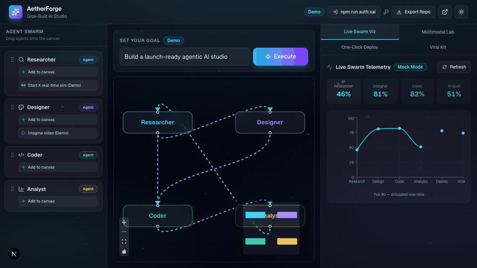

# AetherForge - Grok-Built Agentic AI Studio

> **A cinematic Next.js prototype/template for agentic AI workflows, built around a swarm canvas, mock-safe execution, and optional live xAI routes.**



## Live Demo

[Open AetherForge on Vercel](https://aether-forge-beta.vercel.app)

## Launch Video

[Watch the 22-second English launch video](public/launch-video.mp4)

## ✨ What is AetherForge?

AetherForge is an interactive demonstration of agentic AI tooling. Drag four specialized agents onto a collaboration canvas, set a goal, and watch the swarm execute - generating code, visuals, X threads, and analytics in mock-safe mode or through optional live xAI credentials.

Built as a **Grok Build** showcase for GitHub, Vercel, and X.

## 🎯 Core Features — Real vs Demo

| Feature | Mode | Description |
|---------|------|-------------|
| **Goal Execution** | **Real** (OAuth or `XAI_API_KEY`) / **Demo** (no creds) | Streaming NDJSON via `/api/execute` — Grok plan, code, X thread, chart data, image (`grok-imagine-image-quality`) |
| **Generated Code** | **Real** / **Demo** | Runnable TypeScript from Grok when live; deterministic mock otherwise |
| **X Thread Draft** | **Real** / **Demo** | Grok-authored posts when live (no fake engagement metrics) |
| **Generated Image** | **Real** / **Demo** | Grok Imagine when live; gradient placeholder when mock |
| **Agent Sidebar** | **Demo** | Draggable agents — Researcher (X sim), Designer (Imagine sim) |
| **React Flow Canvas** | **Real** | Connect agents, collaborate visually |
| **Live Swarm Viz** | **Demo** | Simulated telemetry charts (Recharts) |
| **Multimodal Lab** | **Mixed** | Image: **Real** when live via `/api/generate-image`; video/audio: **Demo** |
| **One-Click Deploy** | **Demo** | Vercel button + README generator |
| **Viral Kit** | **Demo** | Auto X thread + image pack |
| **PWA** | **Real** | Installable, offline shell |
| **Themes** | **Real** | Dark cosmic glassmorphism (default) + light mode |

### Run the live demo

**Option A — Local OAuth (no API key, unofficial/local-only)**

```bash
npm run auth:xai          # browser PKCE sign-in (SuperGrok / X Premium+)
AI_MODE=auto npm run dev  # prefers OAuth token, badge shows "OAuth"
```

OAuth reuses xAI's browser login (reverse-engineered). It may return HTTP 403 on some tiers — set `XAI_API_KEY` to fall back to the API path. Tokens are stored in `~/.aetherforge/xai-auth.json` (git-ignored).

**Option B — API key (git / Vercel / deploy)**

Copy `.env.example` → `.env.local`, set `XAI_API_KEY`, and `AI_MODE=auto` or `AI_MODE=key`. Badge shows "API key". Model names are validated at boot — verify at [docs.x.ai](https://docs.x.ai).

With neither OAuth nor API key, `AI_MODE=auto` resolves to mock (badge "Demo"). CI and tests need no credentials.

## 🚀 Quick Start

```bash
npm install
npm run dev
```

Open [http://localhost:3000](http://localhost:3000)

## 🛠 Stack

- **Next.js 16** — App Router + streaming Route Handlers
- **TypeScript** — Strict typing throughout
- **Tailwind CSS v4** — Cosmic glassmorphism theme
- **shadcn/ui** — Accessible component primitives
- **Framer Motion** — Execution animations
- **React Flow** — Agent collaboration canvas
- **Recharts** — Live swarm metrics
- **Three.js** — Cosmic particle background
- **Supabase Mock** — localStorage session persistence

## 📦 Deploy

The app runs safely in mock mode without credentials. Add `XAI_API_KEY` later if you want live xAI output.

```bash
chmod +x scripts/deploy-vercel.sh
./scripts/deploy-vercel.sh
```

Or deploy manually:

```bash
npm run build
npx vercel --prod
```

## 🧪 Tests

```bash
npm test
```

## 📸 Demo GIF

`public/demo.gif` should show:
1. Dragging agents onto the canvas
2. Executing a goal
3. Browsing all four tabs

Regenerate launch media while the dev server is running:

```bash
npm run dev -- --port 3456
node scripts/create-launch-assets.mjs http://localhost:3456
```

## 📁 Project Structure

```
src/
├── app/api/          # Streaming execute + image generation (server-only)
├── actions/          # Legacy mock action (tests)
├── components/
│   ├── canvas/       # React Flow + goal executor
│   ├── layout/       # Header, particles, theme
│   ├── sidebar/      # Draggable agent cards
│   ├── tabs/         # 4 feature tabs
│   └── ui/           # shadcn primitives
└── lib/
    ├── ai/           # Grok client, env validation, live/mock routers
    ├── generators/   # Mock output functions (AI_MODE=mock)
    ├── storage/      # Supabase mock (localStorage)
    └── export/       # Repo zip exporter
```

## 🌌 Theme

Dark cosmic xAI-inspired glassmorphism with cyan/violet accents. Toggle light mode via the header sun/moon button.

## License

MIT

---

*Forged with Grok Build — share on X and tag @Grok*
